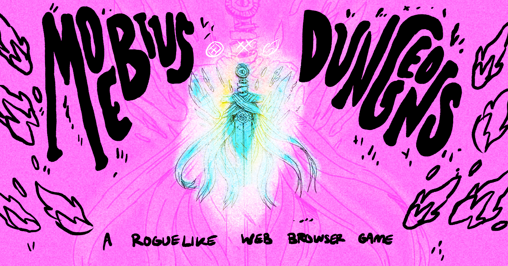

### Yo! I'm Sean Yager, a Full Stack Web Developer specializing in Frontend UI/UX using Vue as a framework. I'm also learning React JS.

---

 

Starting January 2021 I'm focusing on improving and updating [Moebius Dungeons](https://moebiusdungeons.com/), my Vue JS experiment that aims to create a fully fledged Monster Brawler RPG in browser. :crossed_swords:

<!--  -->

 The game always needs playtesting, so if you'd like check out the current build it's at the link below.

# :video_game: [PLAY MOEBIUS DUNGEONS HERE](https://moebiusdungeons.com/) :video_game:

Any issues can be brought to my attention via [the issues tab of the Moebius Dungeons repository.](https://github.com/MisuseofMana/moebiusDungeons) :warning:

## I'm currently looking for a job working with Vue JS to creat unique experiences on the web, please feel free to reach out to me via contact@seanyager.com with any questions or leads. :mailbox:

I love talking about Vue.js so email me if you're curious about any of my code, or want to make a connection please reach out!

### [Linked In](https://www.linkedin.com/in/seanyager/) | [Portfolio](https://www.seanyager.com/) | [My Instagram](https://www.instagram.com/misuseofmana/)  

My pronouns are he/him.

---

<!--
**MisuseofMana/MisuseofMana** is a ✨ _special_ ✨ repository because its `README.md` (this file) appears on your GitHub profile.

Here are some ideas to get you started:

- 🔭 I’m currently working on ...
- 🌱 I’m currently learning ...
- 👯 I’m looking to collaborate on ...
- 🤔 I’m looking for help with ...
- 💬 Ask me about ...
- 📫 How to reach me: ...
- 😄 Pronouns: ...
- ⚡ Fun fact: ...
-->
